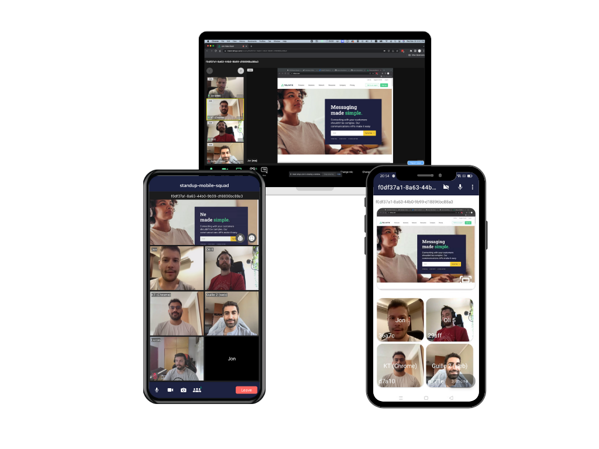

# Telnyx Meet Android App
This application demonstrates multi-party voice and video built with [Telnyx Android Video SDK](https://github.com/team-telnyx/telnyx-video-android).

### 

## Features

- [x] Video conferencing with real-time video and audio
- [x] Enable/disable camera
- [x] Switch between front and back camera
- [x] Mute/unmute mic
- [x] Select audio source
- [x] Speaker indicator
- [x] Audio censored indicator
- [x] TextChat capabilities

## Requirements

Android Studio Version | Android API Version Min
------------ | -------------
3.5+ | 23

## Getting Started

In order to run this application on an Android device or emulator, complete the following steps. [More info regarding VideoRooms](https://developers.telnyx.com/docs/v2/video-rooms)

1. Sign up for a Telnyx Account
2. Create an API KEY
3. Create a Room ID
4. Clone code and open in Android Studio
5. Setup environment variables
6. Run the app


## Step 1: Sign Up for a Telnyx Mission Control Portal Account

Head to [telnyx.com/sign-up](https://telnyx.com/sign-up) to sign up for your free Telnyx account.

Once signed up you will have access to Telnyx Portal, where you can set up and manage your API KEY, and more.


## Step 2: Create an API KEY

Go to [API Keys](https://portal.telnyx.com/#/app/api-keys) section and click on `Create API Key` button. It will generate a key for you. Copy and save this key in a safe place and don't share it with anyone it is a sensitive value.

You need this API Key to consume the API `https://api.telnyx.com/v2/rooms` to manage your room ids.

## 

## Step 3: Create a Room ID

You should read this documentation [video/Rooms](https://developers.telnyx.com/docs/api/v2/video/Rooms) to learn how to create a new video room id. When you get your `roomId` you can join in a video meet conference.

## Step 4: Clone the code

```bash
  % git clone https://github.com/team-telnyx/telnyx-meet-android.git
```

Open code in Android Studio

## Step 5: Setup environment variables

Inside *telnyx/meet/di/NetworkModule* class, modify **_provideApiKey()_** method to provide the API Key you retrieved on [Step 2](#step-2-create-an-api-key)

```kotlin
@Module
@InstallIn(SingletonComponent::class)
object NetworkModule {
...
...
@Provides
    @ApiKey
    fun provideApiKey() = "KEY017450AB72C...."

...
...
```
## Step 6: Run the app

Install and run the app in an Android device or emulator.
Fill the **Room Id** described on [Step 3](#step-3-create-a-room-id) and provide a local participant name (defaults to Android Participant)
<p align="left">
    
</p>

## Tests

### Integration Tests

* Android Studio - Right click and run unit tests on package ```src/androidTest/java/com/telnyx/meet/ui/ManageRoomDetailsActivityTest.kt```

## Related

- [Telnyx Meet App iOS](https://github.com/team-telnyx/telnyx-meet-ios)
- [Telnyx Meet App JS](https://github.com/team-telnyx/telnyx-meet)

## License

Apache 2.0 license. See [LICENSE.txt](LICENSE.txt) for details.
